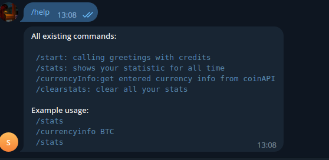

<h1 align="center">Hi there, I'm <a href="https://github.com/ampheee"> Rustam</a>
<h3 align="center">Computer science student, IT-engineer from Russia 🇷🇺</h3>
<h4 align="center"> My <a href="https://t.me/ampheee"> telegram</a>. Text me, if something went wrong/ </h4>

<h3 align="center">## Non-production. Entry-task project ##<h3/>

### Start:
    
    1. Setup your config in internal/config (input own tgToken, coinApi token)
    2. In terminal: cd cmd
    2. In terminal: go run main.go -migration=true
        if alright - check message "Bot was started" in terminal logs

### Usage:

    Examples of usage: 

Examples of db-operations:

    Requests && users tables before /clearstats

    Requests && users tables after /clearstats

### Technologies:
    zerolog
    rusty
    postgresql
    etc...
    

### Migration files included. Check pkg/postgresql/migrations

### That project without active docker-compose && dockerfile :(